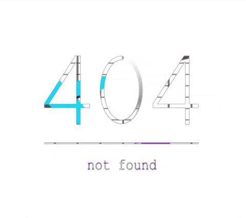

## Bem-vindo ao meu perfil do GitHub! 👋

  

Sou um Analista e Desenvolvedor de sistemas apaixonado por tecnologia e pela comunidade de tecnologia. Com uma formação em Sistemas de Informação e pós-graduação em Engenharia de Software, tenho uma sólida base educacional e experiência em diversas áreas relacionadas ao desenvolvimento de software.

Atualmente, atuo como Analista e Desenvolvedor na Plano Sistemas, onde tenho a oportunidade de colocar em prática meus conhecimentos e contribuir para o desenvolvimento de soluções inovadoras. Tenho uma abordagem orientada para resultados e sou um entusiasta em buscar novos conhecimentos, sempre buscando elevar meu nível de habilidades.

Ao longo da minha jornada, também me dediquei à minha educação contínua, completando cursos e participando de programas de aperfeiçoamento na área de desenvolvimento de software. Minha formação inclui a Graduação em Sistemas de Informação, além de outros cursos e áreas afins.

Estou sempre aberto a colaborações e oportunidades de aprendizado. Sinta-se à vontade para explorar meus repositórios e entrar em contato comigo para discutir ideias, projetos ou apenas trocar experiências.

Vamos codificar juntos e levar a tecnologia a um próximo nível! 🚀

---

  &nbsp;
  &nbsp;
  &nbsp;
  &nbsp;
  &nbsp;
  &nbsp;

<!--
**Dheizon/Dheizon** is a ✨ _special_ ✨ repository because its `README.md` (this file) appears on your GitHub profile.

Here are some ideas to get you started:

- 🔭 I’m currently working on ...
- 🌱 I’m currently learning ...
- 👯 I’m looking to collaborate on ...
- 🤔 I’m looking for help with ...
- 💬 Ask me about ...
- 📫 How to reach me: ...
- 😄 Pronouns: ...
- ⚡ Fun fact: ...
-->
